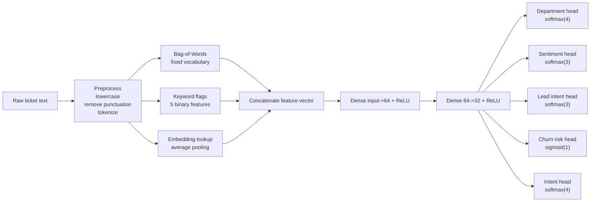

# Tickets-Inf

`tickets-inf` is a pure Go inference engine for a tiny hybrid neural network that classifies raw support-ticket text into five tasks at once:

- `department`: `billing | tech | sales | general`
- `sentiment`: `positive | neutral | negative`
- `lead_intent`: `high | medium | low`
- `churn_risk`: `high | low`
- `intent`: `refund | delivery_query | complaint | other`

The runtime is designed for low-latency CPU inference, small memory usage, and simple deployment. There are no external ML libraries, no CGO requirements, and no dependency on TensorFlow, PyTorch, ONNX Runtime, or similar stacks.

## Highlights

- Hybrid feature pipeline: bag-of-words + keyword flags + learned embeddings
- Shared tiny MLP base with five task heads
- Pure Go neural ops implemented from scratch
- JSON model loading for float32 and optional int8 weights
- Compatibility with both the legacy demo schema and the training pipeline export schema
- Optional quantized inference path
- Confidence scores for every prediction head
- Top-k predictions for intent
- Debug mode to inspect normalized text, tokens, and final feature vector
- Small package layout intended for embedding inside APIs, workers, or edge services

## Tasks and Outputs


| Task          | Labels                                           | Activation |
| ------------- | ------------------------------------------------ | ---------- |
| `department`  | `billing`, `tech`, `sales`, `general`            | softmax    |
| `sentiment`   | `positive`, `neutral`, `negative`                | softmax    |
| `lead_intent` | `high`, `medium`, `low`                          | softmax    |
| `churn_risk`  | `high`, `low`                                    | sigmoid    |
| `intent`      | `refund`, `delivery_query`, `complaint`, `other` | softmax    |


Each head returns:

- final label
- confidence score for the winning label
- per-label probability map

The `intent` head also returns `intent_top_k`.
The engine also returns a deterministic `human_readable` block with a summary, triage note, and reply draft.

## Architecture




### Feature Vector Layout

The final feature vector is:

```text
[ bag_of_words | keyword_flags | pooled_embedding ]
```

Dimension formula:

```text
feature_size = bow_vocab_size + 5 + embedding_dim
```

Example with `bow_vocab_size=1000` and `embedding_dim=16`:

```text
1000 + 5 + 16 = 1021 float32 values
```

### Shared Base and Heads

Base network:

```text
Dense(feature_size -> 64)
ReLU
Dense(64 -> 32)
ReLU
```

Heads:

```text
department   : Dense(32 -> 4)  -> Softmax
sentiment    : Dense(32 -> 3)  -> Softmax
lead_intent  : Dense(32 -> 3)  -> Softmax
churn_risk   : Dense(32 -> 1)  -> Sigmoid
intent       : Dense(32 -> 4)  -> Softmax
```

## Project Structure

```text
.
├── benchmark/        # benchmark dataset loader, providers, parser, report runner
├── cmd/bench/        # benchmark CLI for local and hosted model comparisons
├── cmd/demo/         # CLI runner and demo model exporter
├── features/         # preprocessing, BoW, keyword flags, feature concatenation
├── inference/        # public engine API, prediction pipeline, response types
├── model/            # model types, JSON loader, validation, dense ops, demo model
├── quantization/     # int8 row-wise quantization helpers
├── utils/            # labels and ranking helpers
└── testdata/         # benchmark dataset and test fixtures
```

## Quick Start

### 1. Run the built-in demo model

```bash
go run ./cmd/demo -text "Please refund the money and cancel this invoice"
```

This uses an internal demo model embedded in Go code. It is useful for smoke testing the pipeline but is not intended as a production-trained classifier.

### 2. Print debug information

```bash
go run ./cmd/demo -debug -text "The app is not working and I want to cancel"
```

Debug mode prints:

- normalized text
- token list
- final concatenated feature vector

It also includes the same debug payload in the JSON result.

### 3. Dump the demo model as JSON

```bash
go run ./cmd/demo -dump-demo-model /tmp/demo_model.json
```

### 4. Load a model from JSON

```bash
go run ./cmd/demo -model /tmp/demo_model.json -text "Can I get pricing and a demo before I buy"
```

### 5. Enable quantized inference

```bash
go run ./cmd/demo -model /tmp/demo_model.json -quantized -text "My delivery is late and delayed"
```

## CLI Flags


| Flag               | Description                                                            |
| ------------------ | ---------------------------------------------------------------------- |
| `-model`           | Path to a JSON model file                                              |
| `-text`            | Support ticket text to classify                                        |
| `-quantized`       | Use int8 weights when available, or quantize float32 weights in memory |
| `-debug`           | Print feature debug information and include it in the output           |
| `-dump-demo-model` | Write the built-in demo model JSON and exit                            |


## Benchmarking

Use the benchmark CLI to compare the local classifier against hosted general-purpose models using the same exported label space from your trained artifact.

```bash
go run ./cmd/bench \
  -local-model ./training/artifacts/model.json
```

Default targets:

- `local`
- `openai:gpt-5-mini`
- `anthropic:claude-sonnet-4-20250514`
- `gemini:gemini-2.5-flash`

Notes:

- External targets require `-local-model` so the prompt can use the exact labels exported by your trained model.
- Hosted providers are skipped automatically when their API keys are not present.
- Use `-include-cases -json-output /tmp/tickets-bench.json` for per-example results.
- Replace `-dataset` with your own JSONL file when you want to benchmark on a larger gold set.

Example output:

```text
Benchmark dataset: testdata/benchmark_cases.jsonl (28 cases)
- local: exact_match=64.3% intent=85.7% department=96.4% sentiment=85.7% lead_intent=85.7% churn_risk=92.9% avg=0.17ms p95=0.18ms errors=0
- openai:gpt-5-mini: skipped (OPENAI_API_KEY is not set)
- anthropic:claude-sonnet-4-20250514: skipped (ANTHROPIC_API_KEY is not set)
- gemini:gemini-2.5-flash: skipped (GOOGLE_API_KEY or GEMINI_API_KEY is not set)
```

## Library Usage

### Create an engine from a file

```go
package main

import (
    "fmt"
    "log"
    "os"

    "github.com/pncraz/tickets-inf/inference"
)

func main() {
    engine, err := inference.LoadEngineFromFile("model.json", inference.Config{
        UseQuantized: true,
        Debug:        true,
        DebugWriter:  os.Stdout,
        IntentTopK:   3,
    })
    if err != nil {
        log.Fatal(err)
    }

    result := engine.Predict("Please refund the money and cancel my invoice")
    fmt.Printf("%+v\n", result)
}
```

### Use the package-level predictor

```go
package main

import (
    "fmt"
    "log"

    "github.com/pncraz/tickets-inf/inference"
    "github.com/pncraz/tickets-inf/model"
)

func main() {
    m, err := model.NewDemoModel()
    if err != nil {
        log.Fatal(err)
    }

    engine, err := inference.NewEngine(m, inference.Config{})
    if err != nil {
        log.Fatal(err)
    }

    inference.SetDefaultEngine(engine)
    result := inference.Predict("Can I get pricing and a demo?")
    fmt.Println(result.Department.Label)
}
```

## Prediction Result Shape

```json
{
  "department": {
    "label": "billing",
    "confidence": 0.99,
    "scores": {
      "billing": 0.99,
      "general": 0.00,
      "sales": 0.00,
      "tech": 0.00
    }
  },
  "sentiment": {
    "label": "negative",
    "confidence": 0.77,
    "scores": {
      "negative": 0.77,
      "neutral": 0.13,
      "positive": 0.09
    }
  },
  "lead_intent": {
    "label": "low",
    "confidence": 0.52,
    "scores": {
      "high": 0.15,
      "low": 0.52,
      "medium": 0.31
    }
  },
  "churn_risk": {
    "label": "high",
    "confidence": 0.93,
    "scores": {
      "high": 0.93,
      "low": 0.07
    }
  },
  "intent": {
    "label": "refund",
    "confidence": 0.95,
    "scores": {
      "complaint": 0.02,
      "delivery_query": 0.01,
      "other": 0.02,
      "refund": 0.95
    }
  },
  "intent_top_k": [
    { "label": "refund", "confidence": 0.95 },
    { "label": "complaint", "confidence": 0.02 },
    { "label": "other", "confidence": 0.02 }
  ],
  "human_readable": {
    "summary": "This looks like a billing ticket, most likely about refund. The customer sentiment appears negative, lead intent is low, and churn risk is high.",
    "triage_note": "Route to billing. Primary intent is refund (95.0% confidence). Sentiment is negative (77.0%), lead intent is low (52.0%), and churn risk is high (93.0%).",
    "reply_draft": "Thanks for reaching out, and sorry for the trouble. We've routed this to our billing team so they can review the request and follow up with the next steps."
  },
  "debug": {
    "normalized_text": "please refund the money and cancel my invoice",
    "tokens": ["please", "refund", "the", "money", "and", "cancel", "my", "invoice"],
    "feature_vector": [0.0, 1.0, 0.0]
  }
}
```

## Low-Level Design

### 1. Preprocessing

Implemented in `features/preprocess.go`.

Steps:

1. Convert to lowercase
2. Replace punctuation and non-alphanumeric separators with spaces
3. Collapse repeated whitespace
4. Split by whitespace

Important behavior:

- letters and digits are kept
- punctuation becomes separators
- output is deterministic and allocation-light

Example:

```text
Input : "Refund!! My Order Isn't Working."
Output: "refund my order isn t working"
Tokens: ["refund", "my", "order", "isn", "t", "working"]
```

### 2. Bag-of-Words

Implemented in `features/extractor.go`.

Behavior:

- fixed vocabulary map: `map[string]int`
- output vector length is `max(vocab index) + 1`
- each seen token increments its bucket

This is a count-based bag-of-words representation, not a binary presence vector.

### 3. Keyword Flags

Implemented in `features/keywords.go` and `features/extractor.go`.

Exact output order:

1. `has_refund`
2. `has_cancel`
3. `has_delay`
4. `has_not_working`
5. `has_money`

Current flag rules include token/surface-form matching for:

- refund-like terms: `refund`, `chargeback`, `reimbursement`, `moneyback`
- cancel-like terms: `cancel`, `cancelled`, `cancellation`, `terminate`
- delay-like terms: `delay`, `delayed`, `late`, `shipment`, `shipping`
- not-working signals: `"not working"`, `broken`, `error`, `bug`, `failed`, `down`
- money/billing terms: `money`, `price`, `pricing`, `charge`, `bill`, `invoice`, `payment`

### 4. Embedding Lookup and Pooling

Implemented in `model/ops.go`.

Behavior:

- token IDs are collected using `embedding_vocab`
- unknown tokens are skipped
- vectors are averaged over valid token IDs
- if no known tokens exist, the pooled embedding becomes a zero vector

Formula:

```text
pooled = (e[t1] + e[t2] + ... + e[tn]) / n
```

### 5. Dense Forward Pass

Implemented in `model/ops.go`.

For a dense layer with `out` rows and `in` columns:

```text
y[row] = bias[row] + Σ(weights[row][col] * x[col])
```

Properties:

- no reflection
- no generic tensor library
- contiguous flat storage for float weights at runtime
- optional int8 row-wise dot product path

### 6. ReLU

Implemented in-place:

```text
relu(x) = max(0, x)
```

### 7. Softmax

Implemented with numerical stabilization:

```text
softmax_i(x) = exp(x_i - max(x)) / Σ_j exp(x_j - max(x))
```

Subtracting the maximum logit prevents overflow and is important for production use.

### 8. Sigmoid

Used for `churn_risk`:

```text
sigmoid(x) = 1 / (1 + exp(-x))
```

Probability mapping:

- `high = sigmoid(logit)`
- `low = 1 - high`

### 9. End-to-End Inference Pipeline

The `Engine.Predict` path performs:

1. preprocess text
2. build BoW counts
3. build keyword flags
4. collect embedding token IDs
5. average embedding vectors
6. concatenate features
7. run base dense layer 1 + ReLU
8. run base dense layer 2 + ReLU
9. run each head
10. convert logits to probabilities
11. generate human-readable summary text
12. produce structured response

The engine does not mutate model weights during prediction. In practice, this makes the inference path safe to share across goroutines as long as the configured `DebugWriter` is itself safe for concurrent writes.

## Quantization Design

Implemented in `quantization/int8.go`.

### Strategy

- row-wise symmetric int8 quantization
- one float scale per output row
- values clipped into `[-127, 127]`

Per-row scale:

```text
scale = max(abs(row_values)) / 127
```

Quantization:

```text
q = round(value / scale)
```

Dequantized dot product:

```text
dot(row, x) = Σ(q[col] * scale * x[col])
```

### Runtime Behavior

If `UseQuantized` is enabled:

- pre-quantized tensors from JSON are used directly
- float32 tensors without int8 copies are quantized once in memory during engine construction

If `UseQuantized` is disabled:

- the engine uses float32 when a complete float fallback exists
- quantized-only model artifacts automatically run in quantized mode

This is enforced at initialization time, so invalid artifacts fail fast with a clear error instead of failing later during inference.

## Model JSON Format

Top-level schema:

```json
{
  "bow_vocab": { "refund": 0, "invoice": 1 },
  "embedding_vocab": { "refund": 0, "invoice": 1 },
  "embeddings": {
    "matrix": [[0.1, 0.2], [0.3, 0.4]]
  },
  "base": {
    "dense1": {
      "weights": [[0.0, 0.1], [0.2, 0.3]],
      "bias": [0.0, 0.0]
    },
    "dense2": {
      "weights": [[0.0, 0.1], [0.2, 0.3]],
      "bias": [0.0, 0.0]
    }
  },
  "heads": {
    "department": { "weights": [[0.1], [0.2], [0.3], [0.4]], "bias": [0, 0, 0, 0] },
    "sentiment": { "weights": [[0.1], [0.2], [0.3]], "bias": [0, 0, 0] },
    "lead_intent": { "weights": [[0.1], [0.2], [0.3]], "bias": [0, 0, 0] },
    "churn_risk": { "weights": [[0.1]], "bias": [0] },
    "intent": { "weights": [[0.1], [0.2], [0.3], [0.4]], "bias": [0, 0, 0, 0] }
  }
}
```

### Embedding Block

`embeddings` supports:

- `matrix`: float32 embedding table
- `matrix_int8`: int8 embedding table
- `scales`: one scale per embedding row

You may provide:

- float32 only
- int8 only
- both float32 and int8

When both are present:

- float32 is the fallback path
- int8 is used when quantized inference is enabled

### Dense Layer Block

Each dense layer supports:

- `weights`: `[][]float32`
- `weights_int8`: `[][]int8`
- `scales`: `[]float32`
- `bias`: `[]float32`

### Loader Validation

The model loader checks:

- `bow_vocab` is not empty
- `embedding_vocab` is not empty
- matrix shapes are rectangular
- embedding table covers the highest embedding vocab index
- base layers match `feature_size -> 64 -> 32`
- head shapes match their label counts
- bias length equals number of output rows
- float and quantized copies have matching shapes when both are present
- total float parameter footprint is at most `2MB`

## Exporting a Trained Model

This repository does not train the model. Training can be done in any environment that can export:

- `bow_vocab`
- `embedding_vocab`
- embedding matrix
- dense layer weights
- biases
- optional row-wise int8 versions and scales

Recommended export pipeline:

1. train your tiny multitask network elsewhere
2. freeze the vocabularies used during feature extraction
3. export weights in row-major order as nested JSON arrays
4. verify `feature_size == len(bow_vocab_vector) + 5 + embedding_dim`
5. run `go test ./...`
6. smoke test with `go run ./cmd/demo -model your_model.json`

## Performance Notes

Goals:

- low single-digit microseconds to low-millisecond CPU inference for tiny models
- parameter footprint under `2MB`

Observed local benchmark on the current implementation:

```text
BenchmarkPredict-8    195201    6184 ns/op    2432 B/op    29 allocs/op
```

Notes:

- this benchmark was run against the demo model
- real latency depends on vocabulary size, embedding dimension, JSON model size, and CPU
- keeping the model tiny and the vocab bounded is the main driver of memory and latency

## Testing

Run all tests:

```bash
env GOCACHE=/tmp/go-build-cache go test ./...
```

Run the benchmark:

```bash
env GOCACHE=/tmp/go-build-cache go test -run=^$ -bench=BenchmarkPredict -benchmem ./inference
```

Current tests cover:

- preprocessing and feature extraction behavior
- quantization round-trip sanity
- float32 inference path
- quantized inference path
- quantized-only model validation
- package-level predictor wiring

## Operational Guidance

- Keep vocabularies stable between training and inference.
- Keep BoW indices dense if possible to avoid inflated feature vectors.
- Use `UseQuantized` in production when memory pressure matters.
- Keep `Debug` off in hot paths.
- Reuse a single `Engine` instance across requests instead of reloading the model for every prediction.
- Quantized-only exported artifacts will automatically use quantized mode.

## Limitations

- The included demo model is heuristic and exists only to exercise the pipeline.
- There is no trainer in this repository.
- Tokenization is intentionally simple and whitespace-based.
- BoW is count-based and does not include TF-IDF or subword features.
- The runtime favors simplicity and portability over aggressive SIMD optimization.

## Future Improvements

- batch prediction API
- object pooling to reduce allocations further
- SIMD-optimized dense kernels for large vocabularies
- optional normalized BoW or TF-IDF features
- model metadata/version block in JSON
- export/import utilities for common training pipelines

